# Screenshots do Sistema

## Menu principal

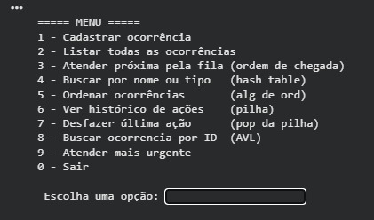

---

## 1 — Cadastrar ocorrência

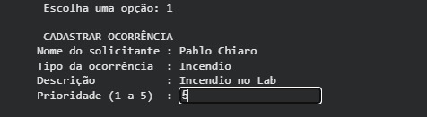

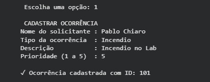

---

## 2 — Listar todas as ocorrências

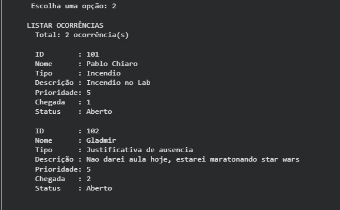

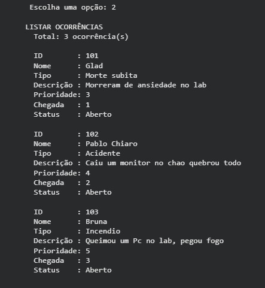

---

## 3 — Atender próxima pela ordem de chegada (Fila)

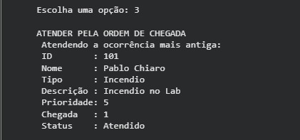

---

## 4 — Buscar por nome ou tipo (Hash Table)

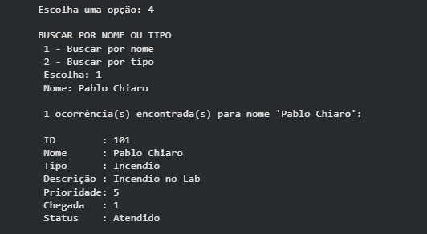

---

## 5 — Ordenar ocorrências (Quicksort)

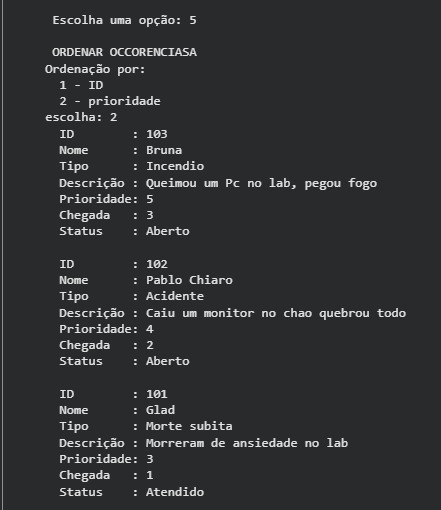

---

## 6 — Histórico de ações (Pilha)

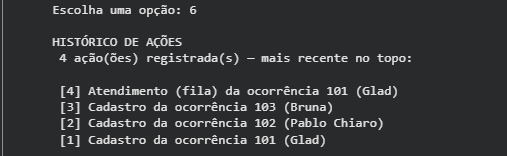

---

## 7 — Desfazer última ação (Pop da pilha)

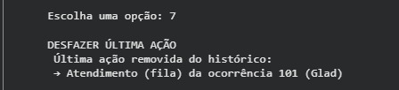

---

## 8 — Buscar ocorrência por ID (Árvore Binária)

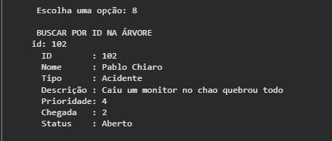

---

## 9 — Atender mais urgente

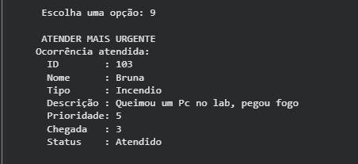
